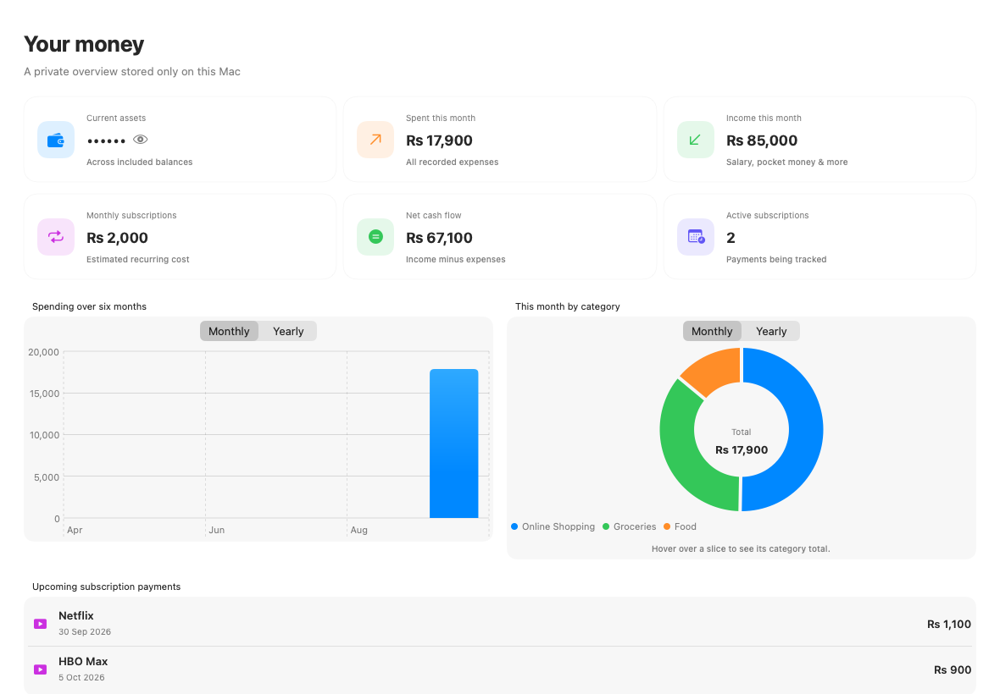

# Pocket Ledger

Pocket Ledger is a private, offline personal finance app for macOS. It tracks subscriptions, everyday expenses, income, current balances, and other assets. All records stay on the Mac.



## Features

- Home dashboard with current assets hidden by default, monthly/yearly spending views, and interactive category charts
- Subscription due dates, variable payment recording, free-trial cancellation reminders, and local Mac notifications
- Expenses grouped into categories such as food, online shopping, transport, and bills
- Month, year, and all-time filters for both expenses and income
- Salary, pocket money, freelance income, gifts, and other money received
- Cash, bank, savings, investment, property, phone, laptop, and other asset balances
- Account-to-account transfers that update both balances without counting as spending or income
- Automatic balance updates when income or expenses are linked to an account
- Clear notification status indicator in Settings
- Optional four-digit app lock with secure Keychain storage and Touch ID unlock
- Immediate local saving, up to 30 automatic backups, manual backup/restore, and CSV export
- No login, server, analytics, advertisements, or internet connection

## Requirements

- macOS 14 or later
- Xcode command-line tools (only needed to build from source)

## Build the Mac app

Open Terminal in this folder and run:

```sh
chmod +x build-app.sh
./build-app.sh
```

The finished application will be created at `build/Pocket Ledger.app`.

## Run tests

```sh
swift test --disable-sandbox
```

## Local data

The app saves its database and backups inside:

```text
~/Library/Application Support/Pocket Ledger/
```

Backups can be opened, created, restored, and exported from the app’s **Settings & backup** page.

## App lock and Touch ID

Open **Settings & backup → App lock** to create a four-digit passcode. When Touch ID is configured on the Mac, it can unlock Pocket Ledger without typing the code. The app locks on launch and whenever you switch away from it. The salted passcode verifier is stored in macOS Keychain and never written to the ledger data file.

## Privacy

Pocket Ledger has no networking code. It does not use a cloud service, collect analytics, or transmit financial information.
